# Ai-meshi

冷蔵庫の残り物からAIが献立を提案し、投稿・共有・買い物リスト作成までつなげるSNS型レシピアプリです。

フロントエンドには Next.js / React、バックエンドには Ruby on Rails API、インフラには AWS ECS Fargate / RDS / S3 を使用しています。AIで生成したレシピを保存・公開し、必要な材料を買い物リストへ送れる一連の体験を重視して開発しました。

アプリケーションや実装内容は以下から確認できます。

- アプリケーション: <https://aimeshi.com/>
- API: <https://api.aimeshi.com/>
- GitHub: <https://github.com/kou-pro/ai-meshi>

## 目次

- [機能](#機能)
- [開発環境 (フロントエンド)](#開発環境-フロントエンド)
- [開発環境 (バックエンド)](#開発環境-バックエンド)
- [本番環境](#本番環境)
  - [インフラ構成図](#インフラ構成図)
- [ER図](#er図)
- [使用技術 (フロントエンド)](#使用技術-フロントエンド)
- [使用技術 (バックエンド)](#使用技術-バックエンド)
- [使用技術 (インフラ・その他)](#使用技術-インフラその他)
- [画面](#画面)
- [工夫した点](#工夫した点)
- [テスト・静的解析](#テスト静的解析)
- [各種リンク](#各種リンク)

## 機能

- 認証
  - メール / パスワードログイン
  - ゲストログイン
  - Google OAuthログイン
  - メールアドレス確認
  - パスワードリセット
  - セッション切れ時の自動ログアウト処理
- レシピ
  - OpenAI APIによるAIレシピ生成
  - レシピ投稿 / 編集 / 削除
  - 公開 / 非公開切り替え
  - レシピ画像アップロード
  - いいね / コメント / 保存
  - 美味しさ・手軽さ・コスパの3軸評価
- 検索・フィード
  - みんなのレシピ
  - 人気レシピ（いいね数順）
  - フォロー中レシピ
  - キーワード検索
  - タグ検索
  - 人気タグ集計
  - ページネーション
- 買い物リスト
  - レシピ詳細から食材を追加
  - チェック / 解除
  - チェック済み削除
  - 全削除
  - レシピ削除後も買い物リストを保持
- ソーシャル
  - フォロー / フォロワー
  - プロフィールページ
  - フォロー / フォロワー一覧

## 開発環境 (フロントエンド)

フロントエンドは Next.js（App Router）で構築しています。レシピの生成・投稿・検索、買い物リストなどの画面を表示し、ユーザーの操作を受け付ける部分を担当します。

```bash
docker compose up -d
docker compose exec next npm install
docker compose exec next npm run dev
```

- URL: <http://localhost:8000>
- 開発言語: TypeScript
- フレームワーク: Next.js / React
- スタイリング: Tailwind CSS

## 開発環境 (バックエンド)

バックエンドは Rails API mode で構築しています。認証、レシピ生成、画像アップロード、買い物リスト、フォロー機能などのAPIを提供します。

```bash
docker compose up -d
docker compose exec rails bundle install
docker compose exec rails bin/rails db:create db:migrate db:seed
```

- Rails API: <http://localhost:3000>
- メールプレビュー: <http://localhost:3000/letter_opener>
- DB: MySQL
- 画像アップロード: Active Storage

## 本番環境

本番環境では、Next.js と Rails API をそれぞれ ECS Fargate サービスとして分けて運用しています。独自ドメインへのHTTPS通信は ALB + ACM で終端し、画像は Active Storage 経由で S3 に保存します。

- Route 53 - DNS
- ALB + ACM - HTTPS終端
- ECS Fargate - Next.js / Rails API
- Amazon RDS for MySQL - データベース
- S3 - レシピ画像・プロフィール画像
- AWS Secrets Manager - 本番機密情報
- ECR - Dockerイメージ管理
- CloudWatch Logs - ECSログ
- GitHub Actions - CI/CD

### インフラ構成図

<p align="center">
  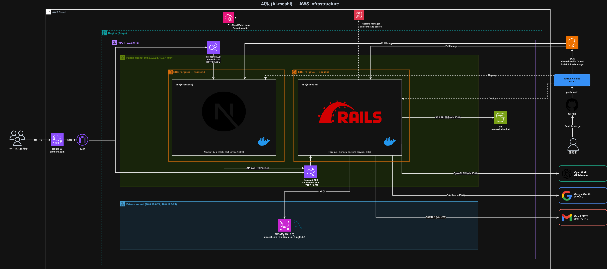
</p>

処理の流れは以下の通りです。

#### リクエストの流れ

1. ユーザーは `aimeshi.com` にHTTPSでアクセスします。
2. Frontend ALB が Next.js の ECS Fargate タスクへリクエストを転送します。
3. Next.js のサーバー側処理が、必要に応じて `api.aimeshi.com` へAPIリクエストを送ります。
4. Backend ALB が Rails API の ECS Fargate タスクへリクエストを転送します。

#### 外部連携

- RDS: ユーザー、レシピ、コメント、買い物リストなどの永続化・取得で利用します。
- S3: Active Storage経由でレシピ画像・プロフィール画像の保存に利用します。
- OpenAI API: AIレシピ生成時に利用します。
- Google OAuth: Googleログイン時に利用します。
- Gmail SMTP: メールアドレス確認・パスワードリセットのメール送信で利用します。

#### デプロイの流れ

`main` ブランチへの push を GitHub Actions が検知し、Docker イメージを ECR へ push したうえで、ECS サービスへデプロイします。

ECSタスクは固定費を抑えるため public subnet に配置していますが、タスクの3000番ポートは ALB の Security Group からのみ許可しています。RDS は private subnet に配置し、3306番ポートは Rails ECS の Security Group からのみ許可しています。

## ER図

<p align="center">
  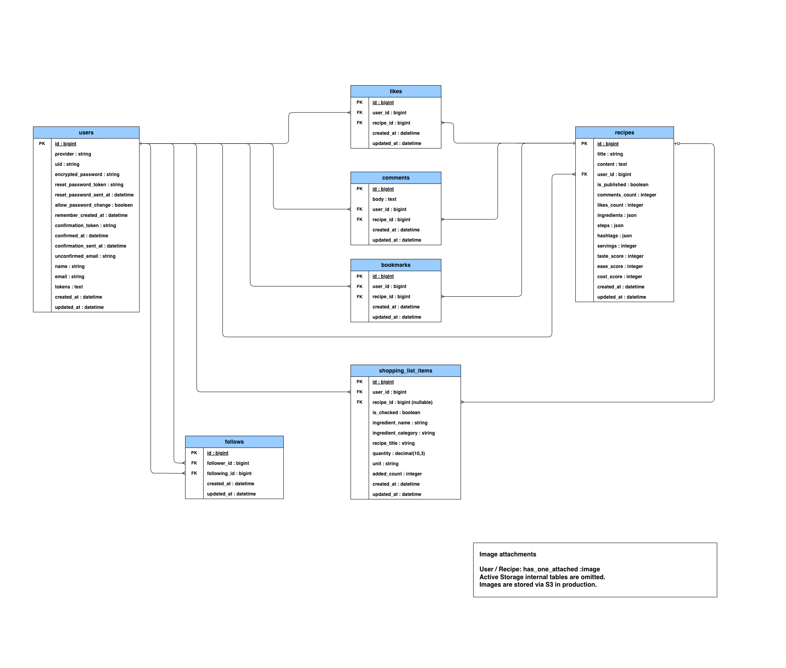
</p>

| テーブル | 役割 |
| --- | --- |
| `users` | 認証情報とプロフィール |
| `recipes` | レシピ本体。材料・手順・タグはJSONカラムで保持 |
| `likes` | いいね。`user_id` と `recipe_id` の組み合わせを一意に制御 |
| `comments` | レシピへのコメント |
| `bookmarks` | 保存済みレシピ |
| `follows` | ユーザー同士のフォロー関係 |
| `shopping_list_items` | 買い物リスト。レシピ削除後も食材情報を保持 |

画像は `User` / `Recipe` に対して `has_one_attached :image` で紐づけています。Active Storage の内部テーブルは図の可読性を優先して省略しています。

## 使用技術 (フロントエンド)

| 技術 | バージョン / 補足 |
| --- | --- |
| [Next.js](https://nextjs.org/docs) | 16.1.6 / App Router |
| [React](https://react.dev/) | 19.2.3 |
| [TypeScript](https://www.typescriptlang.org/) | 5.9.3 |
| [Tailwind CSS](https://tailwindcss.com/docs) | 4.2.0 |
| [Vitest](https://vitest.dev/) | 4.1.6 |

## 使用技術 (バックエンド)

| 技術 | バージョン / 補足 |
| --- | --- |
| [Ruby](https://www.ruby-lang.org/) | 3.2.10 |
| [Rails](https://rubyonrails.org/) | 7.2.3 / API mode |
| [MySQL](https://www.mysql.com/) / [mysql2](https://github.com/brianmario/mysql2) | mysql2 0.5.7 |
| [devise_token_auth](https://github.com/lynndylanhurley/devise_token_auth) | 1.2.6 |
| [omniauth-google-oauth2](https://github.com/zquestz/omniauth-google-oauth2) | 1.2.2 |
| [ruby-openai](https://github.com/alexrudall/ruby-openai) | 8.3.0 |
| [Active Storage](https://guides.rubyonrails.org/active_storage_overview.html) + [aws-sdk-s3](https://docs.aws.amazon.com/sdk-for-ruby/v3/api/Aws/S3.html) | aws-sdk-s3 1.216.0 |
| [RSpec Rails](https://github.com/rspec/rspec-rails) | rspec-rails 8.0.3 |
| [RuboCop](https://rubocop.org/) | 1.84.2 |

## 使用技術 (インフラ・その他)

| 技術 | 用途 |
| --- | --- |
| [AWS ECS Fargate](https://docs.aws.amazon.com/AmazonECS/latest/developerguide/AWS_Fargate.html) | Next.js / Rails API のコンテナ実行 |
| [ALB](https://docs.aws.amazon.com/elasticloadbalancing/latest/application/introduction.html) + [ACM](https://docs.aws.amazon.com/acm/latest/userguide/acm-overview.html) | HTTPS終端 |
| [Amazon RDS for MySQL](https://docs.aws.amazon.com/AmazonRDS/latest/UserGuide/CHAP_MySQL.html) | 本番DB |
| [S3](https://docs.aws.amazon.com/AmazonS3/latest/userguide/Welcome.html) | 画像ストレージ |
| [AWS Secrets Manager](https://docs.aws.amazon.com/secretsmanager/latest/userguide/intro.html) | 機密情報管理 |
| [GitHub Actions](https://docs.github.com/en/actions) | CI/CD |
| [ECR](https://docs.aws.amazon.com/AmazonECR/latest/userguide/what-is-ecr.html) | Dockerイメージ管理 |
| [CloudWatch Logs](https://docs.aws.amazon.com/AmazonCloudWatch/latest/logs/WhatIsCloudWatchLogs.html) | ログ管理 |

## 画面

### トップページ

<p align="center">
  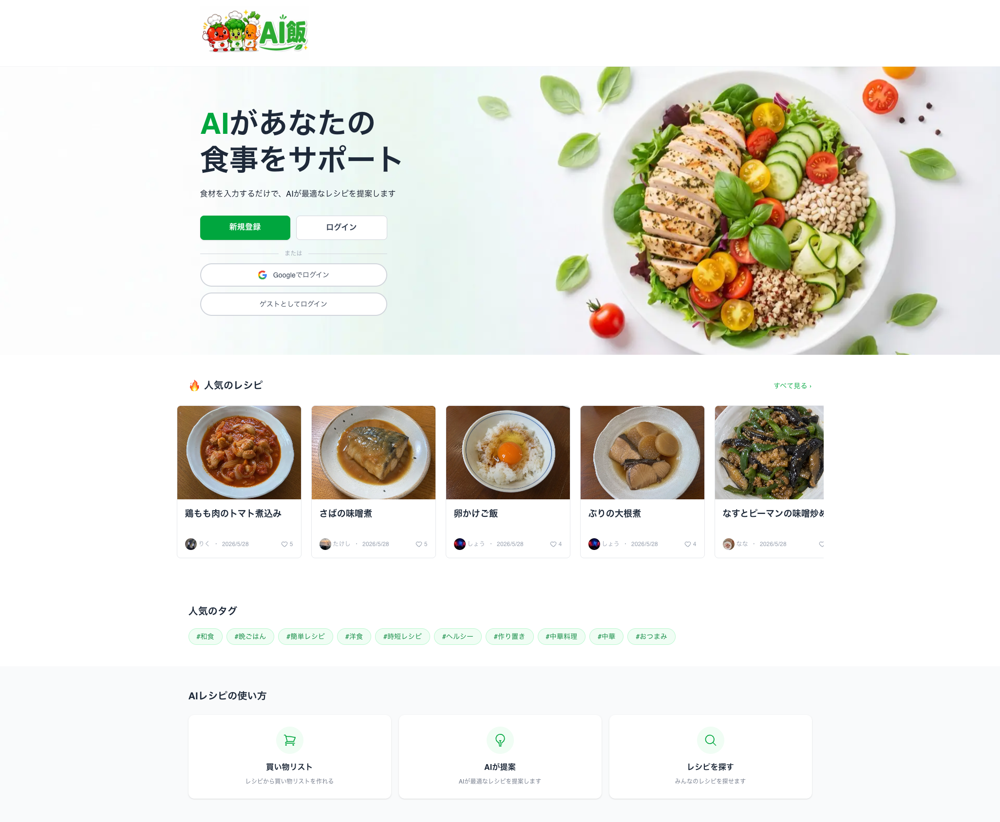
</p>

トップページでは、アプリの概要と主要導線が分かるようにしています。

### レシピ作成

<p align="center">
  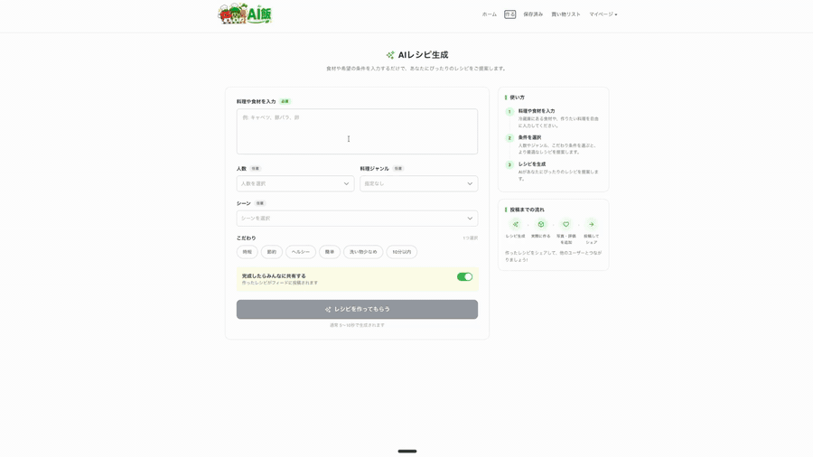
</p>

食材や条件を入力すると、OpenAI APIがレシピ名・材料・手順・ハッシュタグをJSONで生成し、そのまま投稿に進めます。

### 買い物リスト活用

<p align="center">
  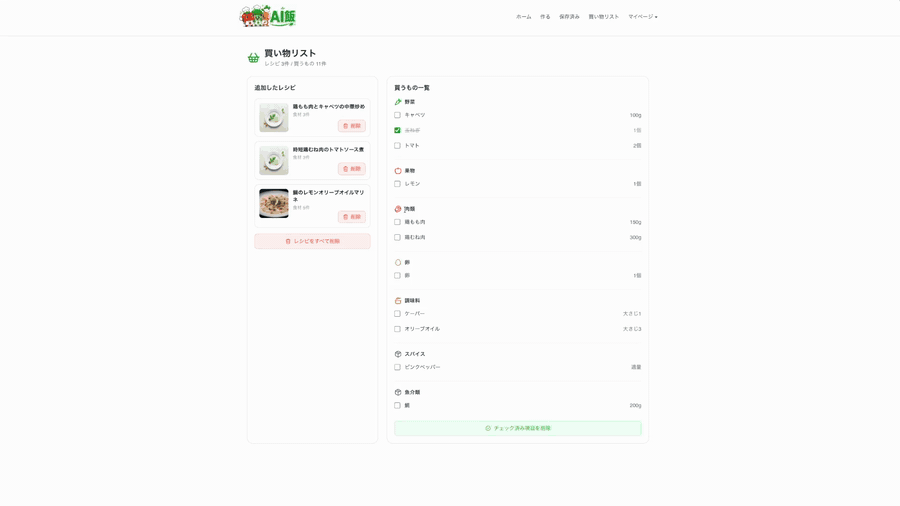
</p>

レシピ詳細から材料を買い物リストに追加し、チェック済み削除・全削除まで操作できます。

> 元動画: [AIレシピ生成](docs/images/readme/generate-demo.mp4) / [買い物リスト活用](docs/images/readme/shopping-list-demo.mp4)

### 認証

<table>
  <tr>
    <td width="50%">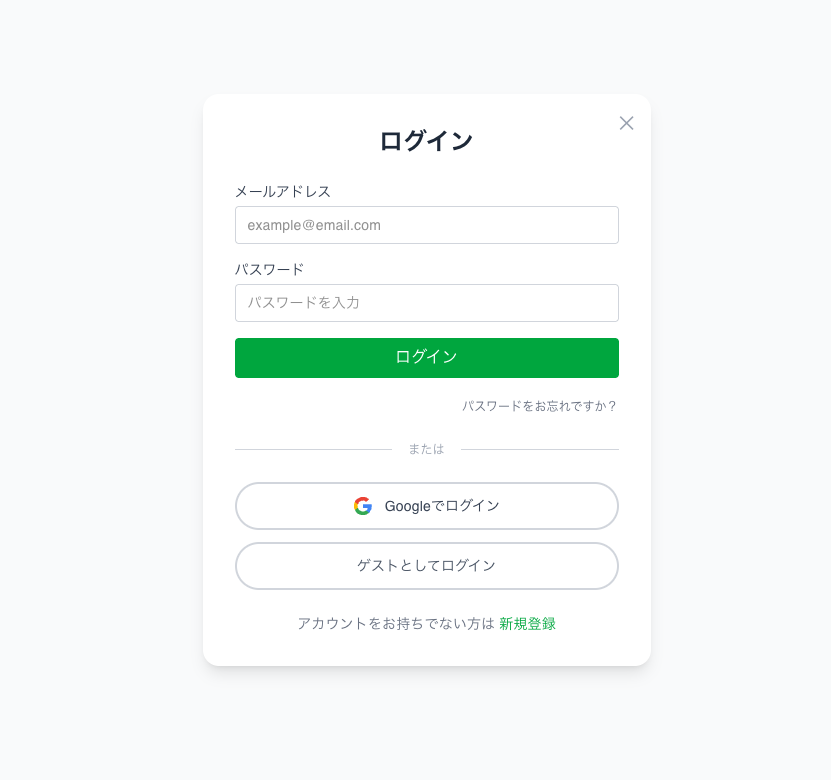</td>
    <td width="50%">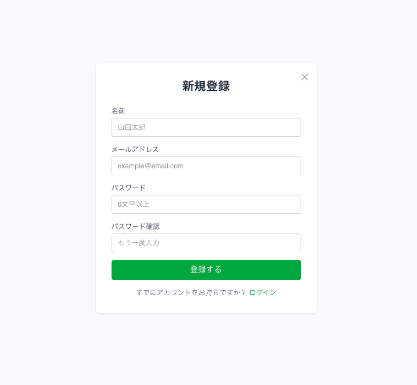</td>
  </tr>
  <tr>
    <td align="center">ログイン</td>
    <td align="center">新規登録</td>
  </tr>
</table>

ログイン画面では、メール / パスワードログイン、新規登録に加えて、ゲストログインも利用できます。

### マイページ関連

<table>
  <tr>
    <td width="50%">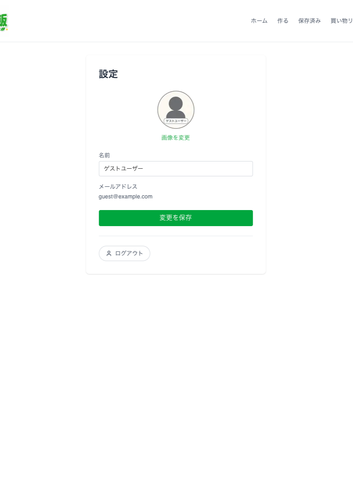</td>
    <td width="50%">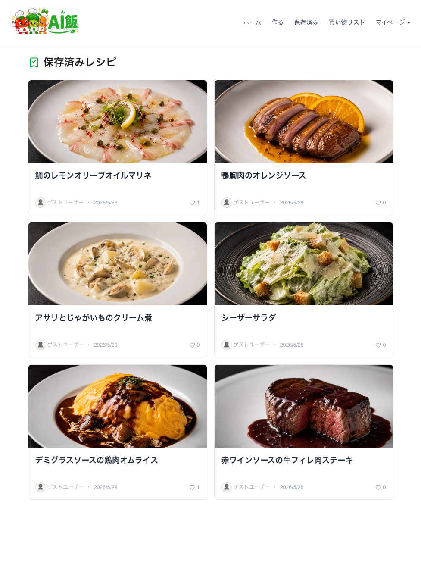</td>
  </tr>
  <tr>
    <td align="center">設定（名前変更 / ログアウト）</td>
    <td align="center">保存済みレシピ</td>
  </tr>
</table>

### レシピ詳細

<p align="center">
  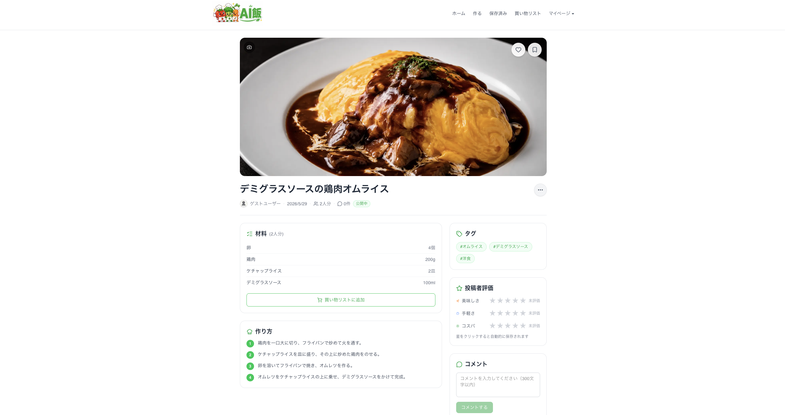
</p>

材料・作り方・タグ・評価・コメントを1画面で確認でき、材料はそのまま買い物リストへ追加できます。

### フォロー

<table>
  <tr>
    <td width="50%">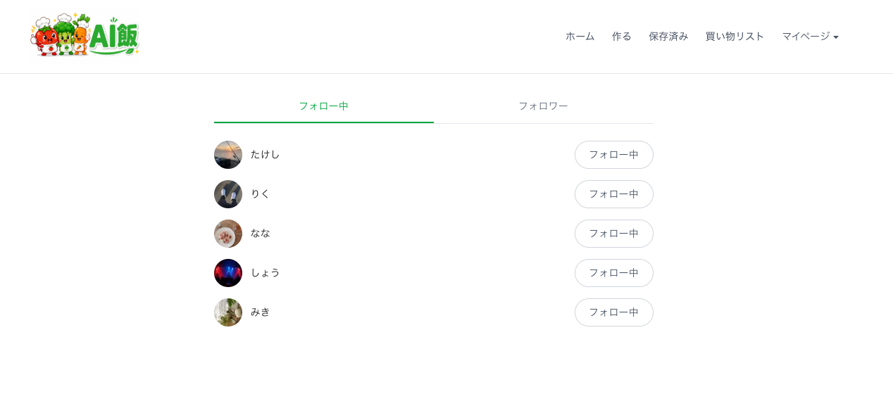</td>
    <td width="50%">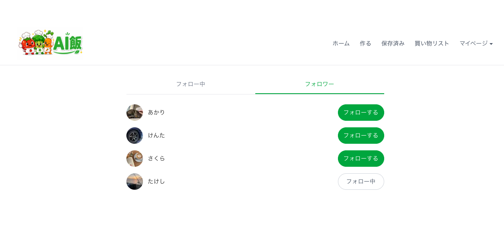</td>
  </tr>
  <tr>
    <td align="center">フォロー中</td>
    <td align="center">フォロワー</td>
  </tr>
</table>

フォロー / フォロワー一覧では、相互フォロー状態に応じてボタン表示を切り替えます。

## 工夫した点

### 1. AI生成から買い物リストまでの導線

AIが生成したレシピを単に表示するだけでなく、材料を買い物リストへ追加できるようにしました。献立決定と買い物準備を分断しないことで、実際の利用シーンに近い体験を目指しています。

### 2. レシピ削除後の買い物リスト保持

レシピを削除しても買い物リスト上の食材情報は残るようにしました。買い物の途中でレシピが消えても必要な食材を見失わないよう、レシピ削除時は参照だけを外し（`dependent: :nullify`）、食材名・レシピ名はスナップショットとして保存しています。

### 3. AWSコストとセキュリティのバランス

個人開発ではNAT Gatewayの固定費が重いため、ECSタスクはpublic subnetに配置しました。ただし、Security GroupでALBからの通信だけに絞り、RDSはprivate subnetに配置してRails ECSからのみ接続可能にしています。

## テスト・静的解析

```bash
# Rails
docker compose exec rails env RAILS_ENV=test bundle exec rspec
docker compose exec rails bundle exec rubocop

# Next.js
docker compose exec next npm run lint
docker compose exec next npm run test -- --run
```

CIではRSpec、RuboCop、ESLintを実行しています。Vitestは主要コンポーネントの確認用として導入しています。

## 各種リンク

- アプリケーション: <https://aimeshi.com/>
- API: <https://api.aimeshi.com/>
- GitHub: <https://github.com/kou-pro/ai-meshi>
